# Análisis del Sector de Telecomunicaciones en Argentina

## Bienvenido al dashboard de análisis del sector de telecomunicaciones en Argentina.

### Contexto y Objetivos
Este proyecto tiene como objetivo examinar la evolución del sector de telecomunicaciones en Argentina, centrándose específicamente en la penetración de internet y la velocidad de conexión en las diferentes provincias del país desde 2014 hasta 2024.

### Desarrollo del Trabajo
El análisis se llevó a cabo siguiendo estos pasos:

* Recolección de datos de la página oficial de ENACOM.
* Limpieza y preparación de los datos.
* Análisis exploratorio de datos (EDA) para identificar tendencias y patrones.
* Creación de visualizaciones interactivas para presentar los hallazgos.
* Formulación de conclusiones y desarrollo de KPIs basadas en el análisis realizado.  

### Fuente de Datos
Los datos utilizados en este análisis fueron obtenidos de la Entidad Nacional de Comunicaciones (ENACOM) de Argentina. ENACOM proporciona datos abiertos sobre el sector de telecomunicaciones, incluyendo estadísticas sobre acceso a internet, velocidades de conexión y distribución geográfica de los servicios.

Puedes explorar más detalles en las secciones de Análisis y Conclusiones.

***

# EDA 1° Parte
### 1. Análisis temporal y geográfico

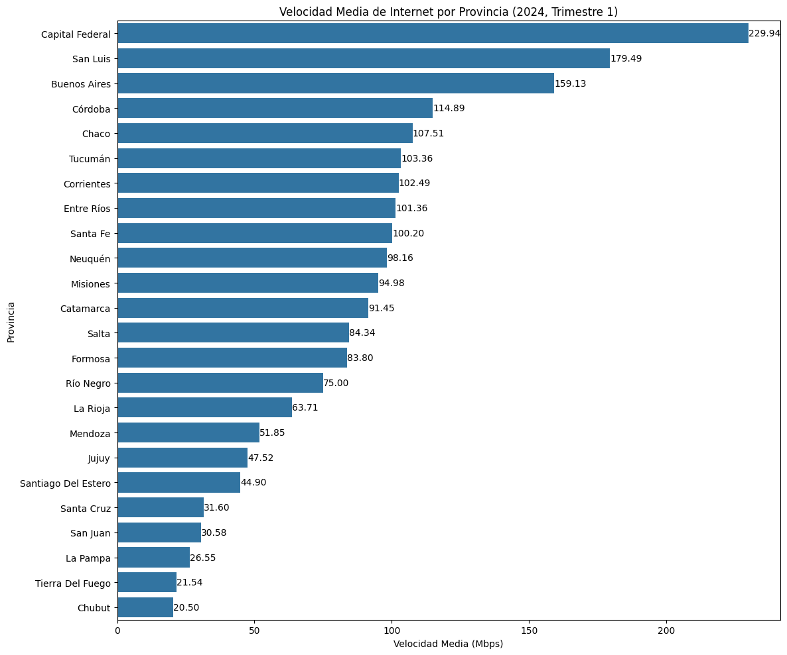

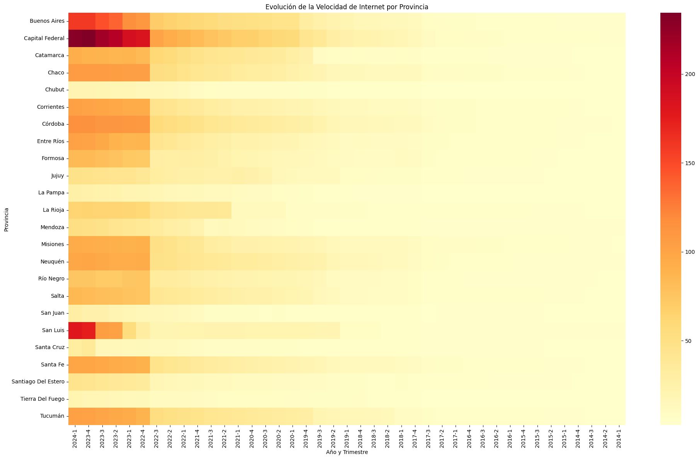

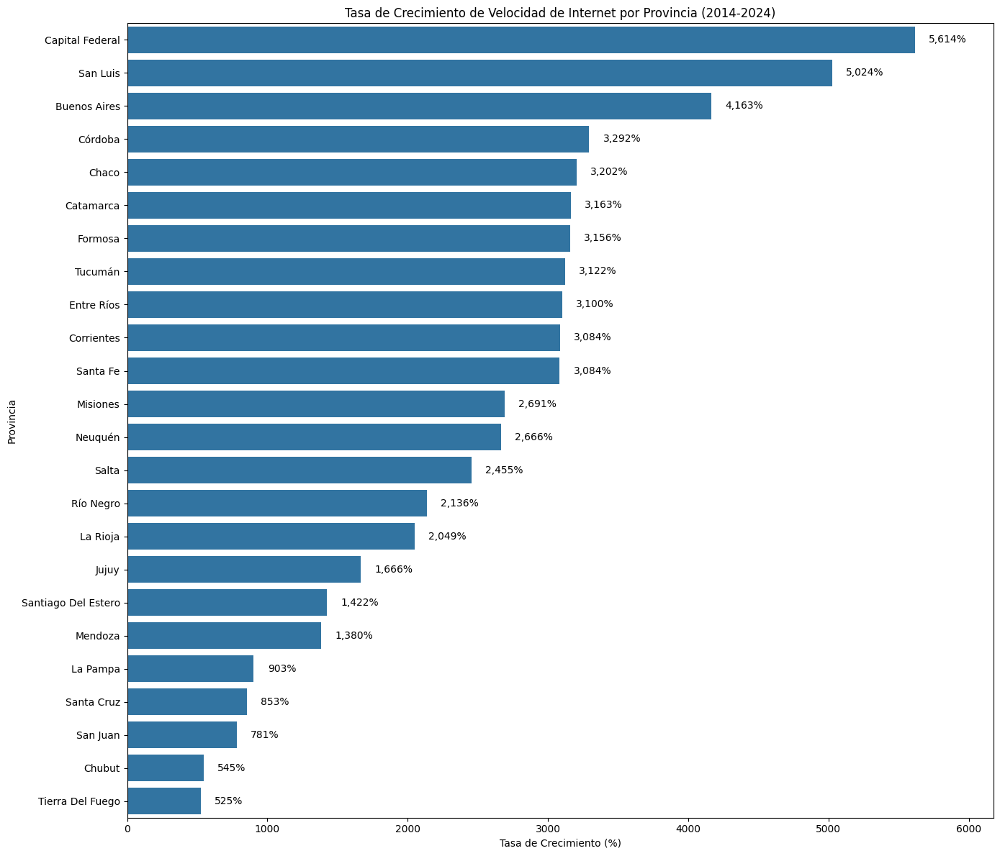

### Análisis Temporal y Geográfico de Internet en Argentina (2014-2024)

#### Disparidad en el Desarrollo de Infraestructura

1. Se observa una marcada diferencia en la calidad y velocidad del servicio de internet entre las distintas provincias y regiones de Argentina.

2. La velocidad media de internet ha aumentado significativamente, pasando de 3.62 Mbps en 2014 a 139.15 Mbps en 2024, lo que representa un crecimiento del 3,744% en una década.

3. Sin embargo, este crecimiento no ha sido uniforme en todas las regiones del país.

#### Diferencias Regionales

1. **CABA (Ciudad Autónoma de Buenos Aires)**: Lidera en términos de velocidad y penetración de internet, con una velocidad media de 229.94 Mbps en 2024.

2. **Región Pampeana**: Sigue a CABA en desarrollo de infraestructura, con Buenos Aires alcanzando 159.13 Mbps en 2024.

3. **Región Centro**: Muestra un desarrollo significativo, aunque menor que CABA y la región Pampeana.

4. **NOA (Noroeste Argentino) y NEA (Noreste Argentino)**: Estas regiones muestran un retraso considerable en comparación con las áreas más desarrolladas.

#### Factores Influyentes

1. **Desarrollo Económico**: Las regiones más desarrolladas económicamente tienden a tener mejor infraestructura de internet.

2. **Urbanización**: Las áreas urbanas generalmente disfrutan de mejores servicios de internet que las zonas rurales.

3. **Políticas Regionales**: Las diferencias en políticas de desarrollo tecnológico entre provincias pueden influir en la calidad del servicio.

4. **Inversión en Infraestructura**: La disparidad en la inversión en infraestructura de telecomunicaciones entre regiones es evidente en los resultados.

#### Evolución Temporal

1. Todas las regiones han experimentado mejoras en la velocidad de internet desde 2014.

2. El crecimiento más rápido se observa a partir de 2017, con una aceleración notable en los últimos años.

3. La brecha entre las regiones más desarrolladas y las menos desarrolladas ha aumentado con el tiempo.

#### Implicaciones

1. **Brecha Digital**: Existe una clara brecha digital entre las diferentes regiones de Argentina, lo que puede tener implicaciones en educación, economía y desarrollo social.

2. **Desafíos de Equidad**: Se necesitan políticas específicas para abordar la disparidad en el acceso y la calidad de internet entre regiones.

3. **Oportunidades de Crecimiento**: Las regiones menos desarrolladas presentan oportunidades significativas para la expansión y mejora de servicios de internet.

### Conclusión

El análisis revela un crecimiento impresionante en la velocidad de internet en Argentina durante la última década, pero también destaca importantes desigualdades regionales. Abordar estas disparidades será crucial para asegurar un desarrollo digital equitativo en todo el país.

### 2. Análisis de tecnologías:

1. Evolución de tecnologías a nivel nacional:

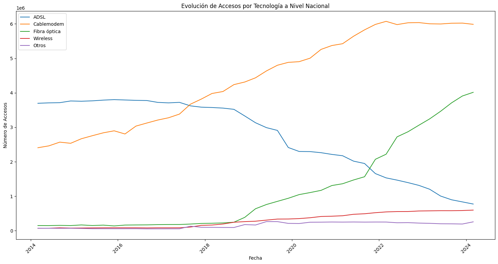

2. Accesos de fibra optica por provincia(ultimo periodo):

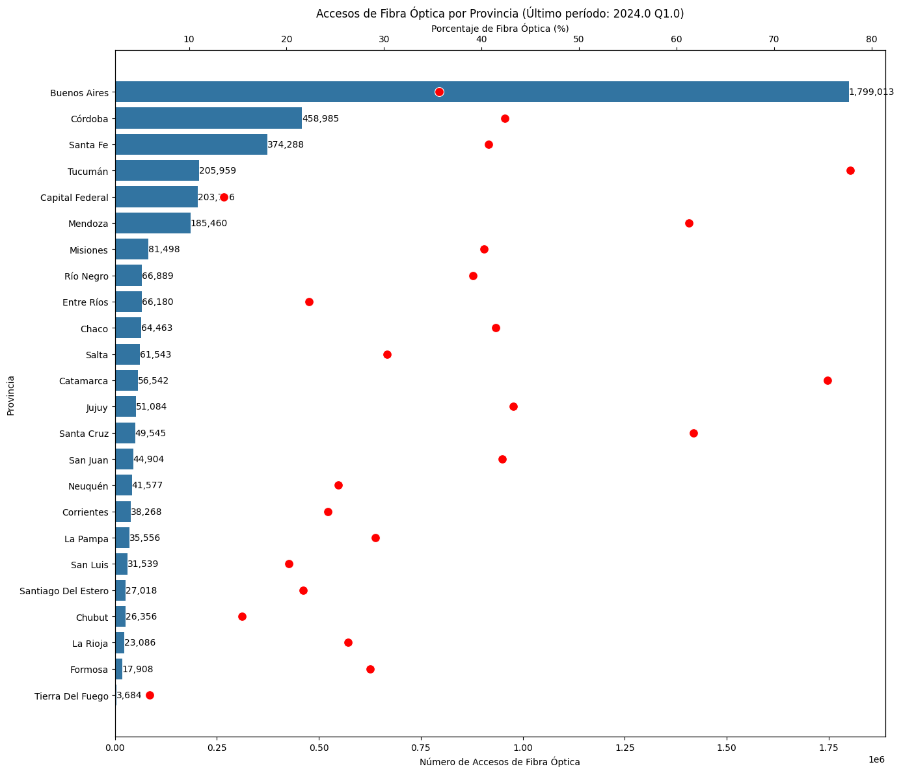

**Período analizado: Año 2024, Trimestre 1**  
    - Provincia con más accesos de Fibra Óptica: Buenos Aires (1,799,013 accesos)  
    - Provincia con menos accesos de Fibra Óptica: Tierra Del Fuego (3,684 accesos)  
    - Promedio de accesos de Fibra Óptica por provincia: 167,296  
    - Mediana de accesos de Fibra Óptica por provincia: 53,813  

### Evolución de Tecnologías de Internet en Argentina (2014-2024)

#### Tendencias Principales

1. **Transición Tecnológica Nacional:**
   - Declive significativo de ADSL desde 2014.
   - Auge del Cablemodem como tecnología dominante desde 2018.
   - Crecimiento exponencial de la Fibra Óptica desde 2019, superando al ADSL en 2022.

2. **Distribución de Tecnologías:**
   - 2014: Predominio de ADSL y Cablemodem.
   - 2024: Liderazgo de Cablemodem y Fibra Óptica, con ADSL en declive.

3. **Variaciones Regionales:**
   - Buenos Aires y Córdoba: Patrones similares al nacional.
   - Mendoza y Tucumán: Adopción acelerada de Fibra Óptica, superando otras tecnologías.

4. **Disparidad en Adopción de Fibra Óptica:**
   - Concentración en provincias más pobladas (Buenos Aires, Córdoba, Santa Fe).
   - Menor penetración en provincias menos pobladas o remotas.

#### Observaciones Adicionales

- **Wireless y Otras Tecnologías:** No varia mucho su penetración, es constante, indicando nichos específicos de mercado.
- **Brecha Tecnológica:** Evidente entre provincias centrales y periféricas, reflejando desigualdades en infraestructura.
- **Velocidad de Transición:** Varía significativamente entre provincias, sugiriendo diferentes niveles de inversión y políticas de desarrollo.

#### Implicaciones

1. **Mejora en Calidad de Servicio:** La transición hacia Fibra Óptica y Cablemodem implica un aumento general en la velocidad y calidad de conexiones.
2. **Desafíos de Equidad:** Necesidad de políticas focalizadas para reducir la brecha digital entre regiones.
3. **Oportunidades de Mercado:** Potencial de crecimiento en áreas con baja penetración de tecnologías avanzadas.
4. **Obsolescencia Tecnológica:** Necesidad de estrategias para la transición de usuarios de ADSL a tecnologías más modernas.

### Conclusión

La evolución tecnológica del internet en Argentina muestra un claro patrón de modernización, con un rápido crecimiento de tecnologías más avanzadas como la Fibra Óptica. Sin embargo, esta evolución no es uniforme en todo el país, evidenciando desafíos persistentes en términos de equidad digital y desarrollo de infraestructura. El futuro del sector dependerá de cómo se aborden estas disparidades y se fomente la adopción de tecnologías de alta velocidad en todas las regiones.

### 3. Análisis de velocidades

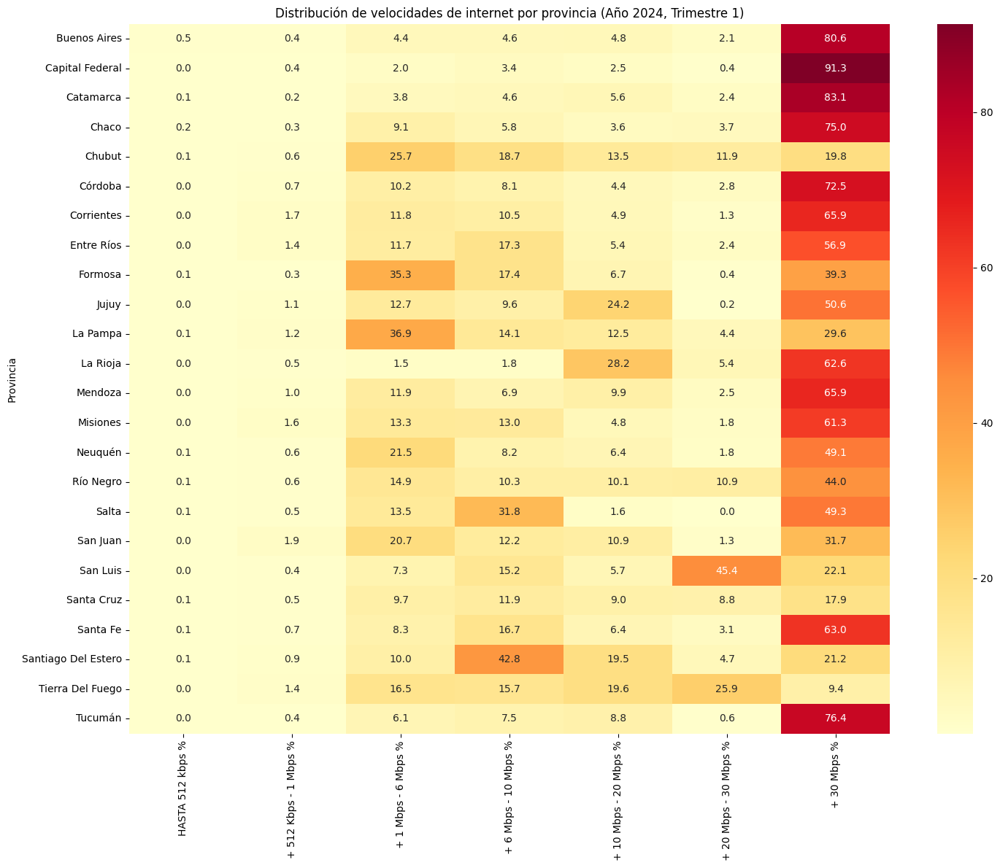

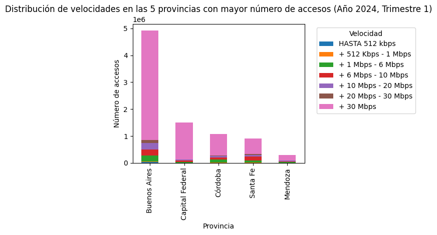

# Análisis de Velocidades de Internet en Argentina (2014-2024)

## Tendencias Principales

1. **Aumento Significativo de Altas Velocidades**
   - Predominio de conexiones de más de 30 Mbps en 2024.
   - Refleja la adopción masiva de tecnologías como fibra óptica y cable módem.

2. **Evolución Temporal**
   - Transición clara desde velocidades bajas y medias hacia altas velocidades.
   - Disminución constante de conexiones de menos de 6 Mbps desde 2014.

3. **Disparidad Geográfica**
   - Provincias más pobladas lideran en adopción de altas velocidades.
   - Algunas provincias menos pobladas muestran rezago en la transición.

## Observaciones Detalladas

### Distribución Nacional
- Más del 50% de las conexiones superan los 30 Mbps en la mayoría de las provincias.
- Capital Federal y Buenos Aires muestran los porcentajes más altos de conexiones de alta velocidad.

### Casos Particulares
- Chubut, Formosa, La Pampa, Santiago del Estero y Tierra del Fuego: Menor proporción de conexiones de alta velocidad.
- Estas provincias muestran una distribución más equilibrada entre diferentes rangos de velocidad.

### Top 5 Provincias
- Buenos Aires, Capital Federal, Córdoba, Santa Fe y Mendoza dominan en número de conexiones.
- Muestran una adopción masiva de velocidades superiores a 30 Mbps.

## Implicaciones y Perspectivas

1. **Mejora en la Experiencia del Usuario**
   - El aumento de velocidades altas sugiere una mejor experiencia en servicios como streaming, videollamadas y gaming online.

2. **Desafíos de Infraestructura**
   - La disparidad entre provincias indica la necesidad de inversiones focalizadas en infraestructura en regiones rezagadas.

3. **Potencial para Nuevos Servicios**
   - La predominancia de altas velocidades abre oportunidades para servicios que requieren gran ancho de banda.

4. **Brecha Digital**
   - Persiste una brecha digital entre regiones, que podría impactar el desarrollo económico y social.

5. **Futuro del Mercado**
   - Probable saturación del mercado de altas velocidades en provincias líderes.
   - Oportunidades de crecimiento en provincias con menor penetración de altas velocidades.

## Conclusión

La evolución de las velocidades de internet en Argentina muestra un claro progreso hacia conexiones de alta velocidad, impulsado por la adopción de tecnologías avanzadas. Sin embargo, la disparidad geográfica persistente subraya la necesidad de políticas e inversiones dirigidas a equilibrar el desarrollo digital en todo el país. El futuro del sector dependerá de cómo se aborde esta brecha y se aprovechen las oportunidades que brindan las altas velocidades de conexión.

### 4. Análisis Económico

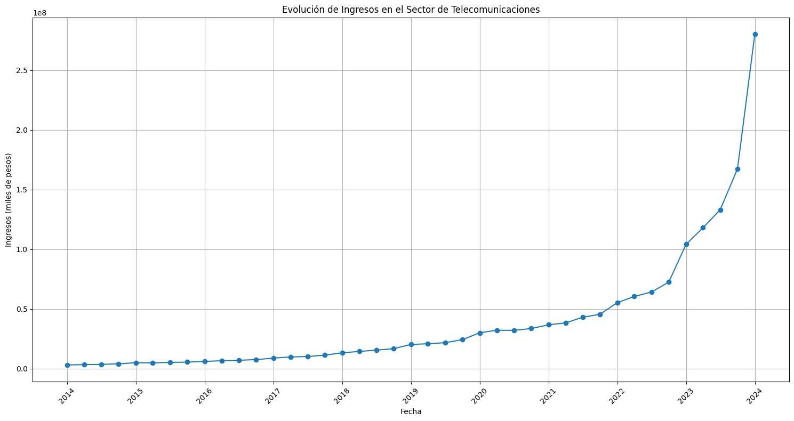

# Análisis Económico del Sector de Telecomunicaciones en Argentina (2014-2024)

## Tendencias Principales

1. **Crecimiento Agresivo de Ingresos**
   - Aumento constante desde 2014, con aceleración exponencial desde 2020.
   - Pico significativo en 2023, hasta incluso en 2024.

2. **Impacto de la Inflación**
   - Alta inflación en Argentina desde 2014, alcanzando más del 200% anual en diciembre 2023.
   - El aumento de ingresos se ve distorsionado no solo por un aumento proporcional en servicios o conexiones, sino por el aumento del valor de los servicios.

3. **Indicadores Clave**
   - Ingreso promedio: 38,850,735.71 miles de pesos
   - Ingreso mínimo: 2,984,054.21 miles de pesos (2014-01-01)
   - Ingreso máximo: 280,419,124.08 miles de pesos (2024-01-01)
   - Tasa de crecimiento promedio trimestral: 11.15%
   - CAGR (Tasa de Crecimiento Anual Compuesto): 20.56%

4. **Distribución Trimestral**
   - Distribución similar de ingresos entre trimestres.
   - Presencia de outliers en los últimos trimestres, posiblemente debido a la alta inflación (impactando en precios) y la crecidaexponencial de aumento de conexiones.

## Análisis Detallado

### Crecimiento vs. Inflación
- El crecimiento exponencial de ingresos debe interpretarse en el contexto de la alta inflación argentina.
- El aumento nominal de ingresos no necesariamente indica un crecimiento real del sector.

### CAGR y Sesgo Potencial
- El CAGR del 20.56% podría estar sesgado por los primeros años de bajo crecimiento.
- Este indicador puede no reflejar adecuadamente la aceleración reciente del crecimiento.

### Análisis Trimestral
- La distribución similar entre trimestres sugiere una cierta estabilidad estacional en los ingresos.
- Los outliers en los últimos trimestres de 2023, y el más importante del primer trimiestre de 2024 reflejan el impacto de la alta inflación y el crecimiento acelerado reciente.

## Implicaciones y Consideraciones

1. **Interpretación Cautelosa**: Es crucial interpretar el crecimiento de ingresos en términos reales, ajustando por inflación.

2. **Resiliencia del Sector**: A pesar de la inestabilidad económica, el sector muestra un crecimiento sostenido, indicando su importancia y resistencia.

3. **Desafíos de Proyección**: La volatilidad económica hace difícil proyectar tendencias futuras basadas únicamente en datos históricos.

4. **Necesidad de Análisis Complementarios**: Evaluar métricas adicionales como el número de suscriptores o el ingreso promedio por usuario para una visión más completa.

5. **Impacto en Inversiones**: El crecimiento sostenido, incluso en términos nominales, puede atraer inversiones al sector, potencialmente mejorando la infraestructura y servicios.

## Conclusión

El sector de telecomunicaciones en Argentina muestra un crecimiento nominal impresionante, pero este debe interpretarse cuidadosamente en el contexto de alta inflación del país. Mientras que el CAGR y las tasas de crecimiento indican un sector en expansión, es esencial considerar factores macroeconómicos para entender el crecimiento real. La estabilidad observada en la distribución trimestral, junto con la reciente aceleración, sugiere un sector resiliente con potencial de crecimiento continuo, aunque sujeto a los desafíos económicos del país.

# EDA 2° Parte:
## Relaciones y correlaciones:
### 1. Penetración vs. Tecnología

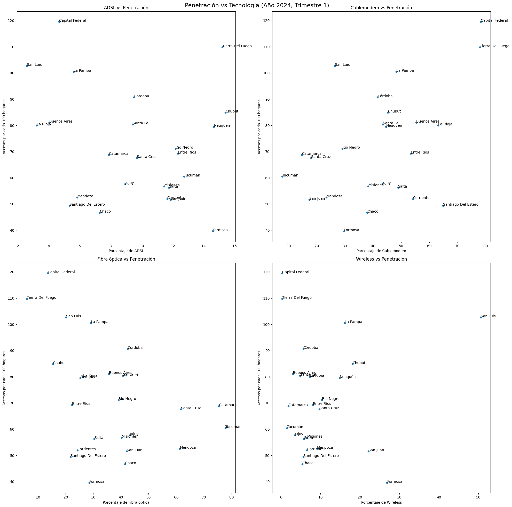

**Correlaciones entre penetración y tecnologías:**
Accesos por cada 100 hogares    1.000000
Cablemodem_porcentaje           0.458014
Wireless_porcentaje             0.068414
ADSL_porcentaje                -0.236858
Fibra óptica_porcentaje        -0.428784

**Interpretación de los resultados:**

**Cablemodem_porcentaje (0.458014):**

Tiene la correlación positiva más fuerte con la penetración.
Esto sugiere que las provincias con un mayor porcentaje de conexiones por cable módem tienden a tener una mayor penetración de internet en los hogares.
La correlación es moderadamente fuerte, lo que indica una relación importante pero no determinante.

**Wireless_porcentaje (0.068414):**

Tiene una correlación positiva muy débil, casi nula.
Esto sugiere que no hay una relación clara entre el porcentaje de conexiones inalámbricas y la penetración de internet en los hogares.

**ADSL_porcentaje (-0.236858):**

Tiene una correlación negativa débil.
Esto sugiere que hay una ligera tendencia a que las provincias con un mayor porcentaje de conexiones ADSL tengan una menor penetración de internet en los hogares.
Sin embargo, la correlación es débil, por lo que no es una relación muy significativa.

**Fibra óptica_porcentaje (-0.428784):**

Tiene una correlación negativa moderada.
Sorprendentemente, esto sugiere que las provincias con un mayor porcentaje de conexiones de fibra óptica tienden a tener una menor penetración de internet en los hogares.
Este resultado es contraintuitivo y podría requerir un análisis más profundo.

**Interpretación general:**

El cable módem parece ser la tecnología más asociada con una alta penetración de internet en los hogares.
La tecnología inalámbrica no parece tener un impacto significativo en la penetración.
Tanto el ADSL como la fibra óptica muestran correlaciones negativas, lo cual es inesperado, especialmente para la fibra óptica.

**Posibles explicaciones y consideraciones:**

La correlación negativa de la fibra óptica podría deberse a que su despliegue es más reciente y aún no ha alcanzado una penetración significativa en muchas áreas.
El cable módem podría ser la tecnología más extendida y madura, lo que explicaría su fuerte correlación positiva.
Estos resultados podrían estar influenciados por factores como la geografía, la densidad poblacional o las políticas de despliegue de infraestructura en diferentes provincias.

**Recomendaciones:**

Investigar más a fondo la situación de la fibra óptica, especialmente en términos de su despliegue y adopción en diferentes provincias.
Considerar factores adicionales como la urbanización, la demografía y las políticas locales que puedan influir en estos patrones.
Analizar la evolución temporal de estas correlaciones para ver si han cambiado con el tiempo.

## 2. Velocidad vs. Penetración

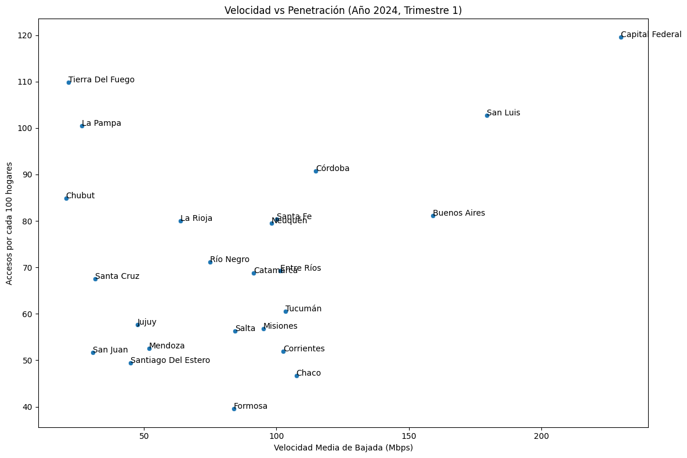

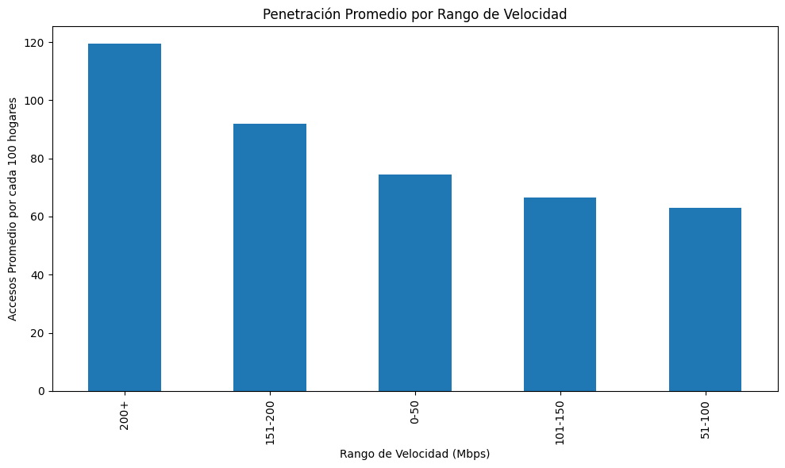

**Correlación entre velocidad y penetración: 0.3311**

Esta correlación positiva moderada sugiere que hay una relación entre la velocidad de internet y la penetración, pero no es una relación fuerte o determinante. Significa que, en general, a medida que aumenta la velocidad, tiende a aumentar la penetración, pero otros factores también influyen significativamente.

**Penetración promedio por rango de velocidad:**

  | Rango_Velocidad | Accesos por cada 100 hogares |
  |-----------------|------------------------------|
  | 200+            | 119.530000                   |
  | 151-200         | 91.900000                    |
  | 0-50            | 74.488571                    |
  | 101-150         | 66.588333                    |
  | 51-100          | 63.093750                    |

Interpretación:  
a) La penetración más alta se observa en el rango de velocidad más alto (200+ Mbps), con un promedio de 119.53 accesos por cada 100 hogares. Esto sugiere que las áreas con las velocidades más altas tienen una adopción de internet muy alta, incluso superando el 100% (lo que podría indicar múltiples conexiones por hogar).  
b) Hay una clara tendencia ascendente en la penetración a medida que aumenta la velocidad, con una excepción notable:  

El rango 151-200 Mbps tiene la segunda penetración más alta.
Sorprendentemente, el rango 0-50 Mbps tiene una penetración más alta que los rangos 51-100 y 101-150 Mbps.  

c) La diferencia en penetración entre los rangos más bajos (51-100 y 101-150 Mbps) es relativamente pequeña, lo que sugiere que otros factores además de la velocidad están influyendo en la adopción en estas categorías.    
**Conclusiones y consideraciones:**  

- Velocidades muy altas (200+ Mbps) están asociadas con una adopción significativamente mayor, lo que podría indicar que estas áreas tienen características particulares (como ser zonas urbanas o económicamente desarrolladas) que favorecen tanto la alta velocidad como la alta adopción.
- La relación entre velocidad y penetración no es completamente lineal, como se evidencia en el rango 0-50 Mbps. Esto podría deberse a:

  * Áreas rurales o menos desarrolladas donde las opciones de internet son limitadas, pero la necesidad es alta.
  * Posibles políticas de inclusión digital enfocadas en áreas de baja velocidad.

El salto significativo en la penetración para velocidades superiores a 150 Mbps sugiere que podría haber un "punto de inflexión" donde la alta velocidad se convierte en un factor más determinante para la adopción.
La moderada correlación (0.3311) indica que, si bien la velocidad es un factor importante, no es el único determinante en la adopción de internet. Otros factores como el costo, la disponibilidad, las políticas locales y las características demográficas también juegan un papel significativo.

**Recomendaciones para análisis adicional:**

- Investigar las características específicas de las áreas con velocidades superiores a 200 Mbps.
- Examinar las razones detrás de la alta penetración en el rango 0-50 Mbps.
Considerar factores socioeconómicos y geográficos que puedan influir en la relación entre velocidad y penetración.

## 3. Evolución Temporal

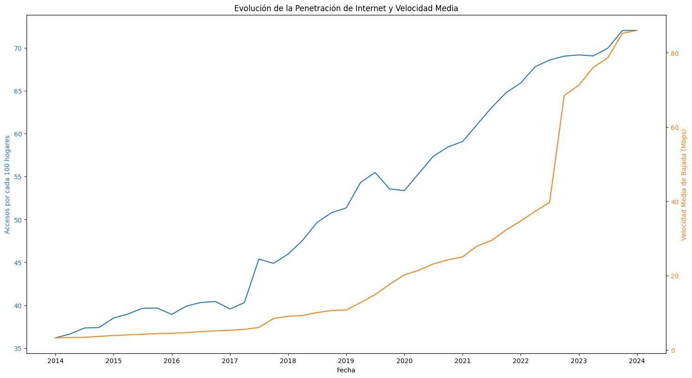

# Análisis de la Evolución de Internet en Argentina (2014-2024)

## Datos Clave
- Tasa de crecimiento de penetración: 99.04%
- Tasa de crecimiento de velocidad: 2554.36%

## 1. Tendencia General
- Claro crecimiento tanto en penetración como en velocidad de internet desde 2014 a 2024.

## 2. Penetración de Internet
- **Inicio (2014):** ~36 accesos por 100 hogares
- **Fin (2024):** ~72 accesos por 100 hogares
- Crecimiento constante, acelerándose desde 2017
- **Tasa de crecimiento:** 99.04% (casi duplicado)

## 3. Velocidad Media
- **Inicio (2014):** <5 Mbps (estimado)
- **Fin (2024):** >80 Mbps
- Crecimiento exponencial, especialmente desde 2017
- Aumento dramático desde 2022
- **Tasa de crecimiento:** 2554.36% (multiplicado por más de 25)

## 4. Comparación de Crecimiento
- Velocidad media creció mucho más rápido que la penetración
- Penetración: duplicada
- Velocidad: multiplicada por 25+

## 5. Puntos de Inflexión
- **2017:** Aceleración en ambas métricas
- **2022-2023:** Crecimiento muy acelerado en velocidad

## 6. Relación Penetración-Velocidad
- Ambas crecen, pero velocidad aumenta más rápidamente
- Sugiere mejora significativa en calidad del servicio

## 7. Implicaciones
- Mayor adopción de internet en hogares argentinos
- Mejoras importantes en infraestructura de internet
- Enfoque en mejorar calidad más que en expandir cobertura

## 8. Consideraciones Finales
- Aún hay margen para aumentar penetración (no alcanza 100%)
- Rápido aumento de velocidad posiblemente debido a nuevas tecnologías (fibra óptica, 5G)

## Conclusión
Desarrollo significativo en infraestructura de internet en Argentina, con énfasis en mejora de calidad del servicio en años recientes.

## 4. Análisis Geográfico

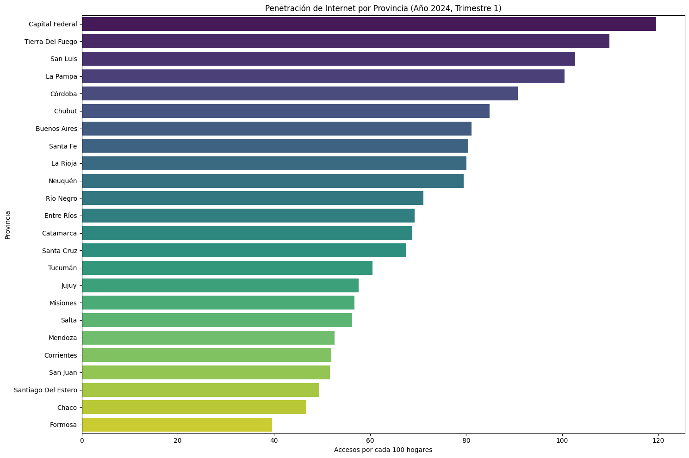

Provincia con mayor penetración: Capital Federal (119.53)
Provincia con menor penetración: Formosa (39.61)

Provincia con mayor velocidad: Capital Federal (229.94 Mbps)
Provincia con menor velocidad: Chubut (20.50 Mbps)

Brecha digital en penetración: 79.92 accesos por 100 hogares
Brecha digital en velocidad: 209.44 Mbps

Correlación entre penetración y velocidad: 0.33

## 5. Ingresos vs. Penetración y Velocidad

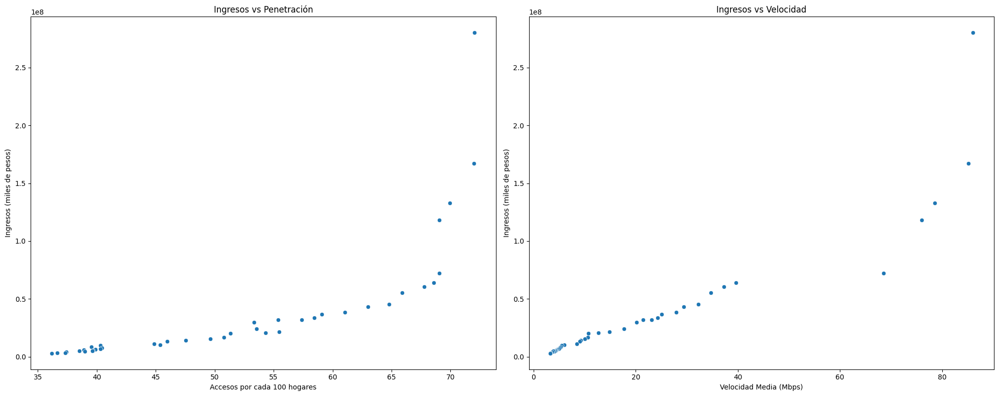

# Análisis de Ingresos vs Penetración y Velocidad en el Sector de Telecomunicaciones

## Resumen de Resultados

### Ingresos vs Penetración
- **Correlación**: Positiva
- **R-cuadrado**: 0.56
- **Pendiente**: 3,383,475.44
- **Intersección**: -137,822,790.03
- **Valor p**: < 0.0001 (estadísticamente significativo)

### Ingresos vs Velocidad
- **Correlación**: Positiva, más fuerte que con penetración
- **R-cuadrado**: 0.84
- **Pendiente**: 2,026,715.42
- **Intersección**: -7,338,809.26
- **Valor p**: < 0.0001 (estadísticamente significativo)

## Interpretación

1. **Relación General**
   - Ambas variables muestran correlación positiva con ingresos
   - Velocidad presenta una relación más fuerte y clara

2. **Penetración vs Ingresos**
   - Tendencia positiva: mayor penetración, mayores ingresos
   - 56% de variabilidad en ingresos explicada por penetración
   - Otros factores también influyen significativamente

3. **Velocidad vs Ingresos**
   - Relación positiva más fuerte
   - 84% de variabilidad en ingresos explicada por velocidad
   - Ajuste más cercano a una línea recta

4. **Comparativa**
   - Velocidad es mejor predictor de ingresos que penetración
   - Aumentar velocidad podría ser más efectivo para incrementar ingresos

5. **Observaciones Adicionales**
   - Puntos atípicos en valores altos sugieren crecimiento reciente o factores externos
   - Relación no perfectamente lineal en ambos casos

## Implicaciones y Consideraciones

1. **Estrategias de Negocio**
   - Priorizar mejoras en velocidad del servicio
   - Combinar aumento de penetración con mejoras de velocidad

2. **Limitaciones del Análisis**
   - Correlación no implica causalidad
   - Posibles factores no considerados: competencia, regulación, cambios tecnológicos

3. **Recomendaciones**
   - Investigar factores adicionales para una visión más completa
   - Considerar efectos combinados de penetración y velocidad

## Conclusión Final

La velocidad de internet muestra una relación más fuerte con los ingresos que la penetración. Mientras que aumentar la cobertura (penetración) es importante, mejorar la calidad del servicio (velocidad) podría ser una estrategia más efectiva para el crecimiento de ingresos en el sector de telecomunicaciones.

# KPI 1: Aumento del Acceso al Servicio de Internet

## Objetivo
Aumentar en un 2% el acceso al servicio de Internet para el próximo trimestre, cada 100 hogares, por provincia.

## Justificación
Ampliar el acceso al servicio de Internet es fundamental para el desarrollo económico y social de las provincias. Incrementar la penetración de Internet permitirá una mayor inclusión digital, mejorando las oportunidades educativas, laborales y de comunicación para los ciudadanos.

## Fórmula
KPI = ((Nuevo acceso - acceso actual) / acceso actual) × 100

## Medición
- **Fuente de Datos:** Datos de ENACOM sobre accesos al servicio de Internet por provincia.
- **Frecuencia:** Trimestralmente.
- **Meta:** Incremento trimestral de al menos un 2% en el número de accesos al servicio de Internet por cada 100 hogares.

# Ejemplos de Implementación y Seguimiento

## Aumento del Acceso al Servicio de Internet
- **Inicial:** En el primer trimestre de 2024, la provincia de Córdoba tiene 500,000 hogares con acceso a Internet.
- **Objetivo:** Aumentar este número en un 2% para el siguiente trimestre.
- **Cálculo:**
Nuevo acceso = 500,000 × 1.02 = 510,000
KPI = ((510,000 - 500,000) / 500,000) × 100 = 2%

# Conclusión
Este KPI de aumento en el acceso al servicio de Internet permitirá evaluar el progreso en la conectividad digital de las provincias, asegurando que cada vez más hogares tengan acceso a este recurso esencial. Aumentar la penetración de Internet en un 2% trimestralmente contribuirá significativamente a la inclusión digital y al desarrollo integral de todas las regiones del país.

# KPI 2: Incremento en la Adopción de Fibra Óptica

## Objetivo
Medir el aumento de la adopción de fibra óptica como tecnología de acceso a Internet en cada provincia.

## Justificación
Dado que la fibra óptica es una tecnología clave para ofrecer altas velocidades de Internet y mejorar la calidad del servicio, este KPI es crucial para evaluar el progreso hacia una infraestructura de telecomunicaciones más avanzada y equitativa.

## Fórmula

Incremento de Fibra Óptica = ((Número de conexiones de fibra óptica actuales - Número de conexiones de fibra óptica iniciales) / Número de conexiones de fibra óptica iniciales) × 100

## Medición
- **Fuente de Datos:** Datos de ENACOM sobre conexiones de fibra óptica.
- **Frecuencia:** Trimestralmente.
- **Meta:** Incremento trimestral de al menos un 5% en el número de conexiones de fibra óptica.

# KPI 3: Reducción de la Brecha Digital entre Provincias

## Objetivo
Evaluar la reducción de la disparidad en la velocidad de Internet entre las provincias más desarrolladas y las menos desarrolladas.

## Justificación
Reducir la brecha digital es esencial para asegurar un desarrollo socioeconómico equitativo y mejorar la calidad de vida en todas las regiones del país.

## Fórmula

Brecha Digital = Velocidad Media en Provincias más Desarrolladas - Velocidad Media en Provincias menos Desarrolladas

## Medición
- **Fuente de Datos:** Datos de ENACOM sobre velocidades de conexión por provincia.
- **Frecuencia:** Trimestralmente.
- **Meta:** Reducción de la brecha en un 10% trimestralmente.

# Ejemplos de Implementación y Seguimiento

## Incremento en la Adopción de Fibra Óptica
- **Inicial:** En el primer trimestre de 2024, Buenos Aires tiene 1,799,013 accesos de fibra óptica.
- **Objetivo:** Aumentar este número en un 5% para el siguiente trimestre.
- **Cálculo:**
Meta = 1,799,013 × 1.05 = 1,888,963.65

## Reducción de la Brecha Digital
- **Inicial:** En el primer trimestre de 2024, CABA tiene una velocidad media de 229.94 Mbps, mientras que Tierra del Fuego tiene 50 Mbps.
- **Brecha Inicial:**
Brecha = 229.94 - 50 = 179.94 Mbps
- **Objetivo:** Reducir la brecha en un 10% para el siguiente trimestre.
- **Cálculo:**
Meta = 179.94 × 0.90 = 161.946 Mbps

# Conclusión
Estos KPIs adicionales, junto con el incremento del acceso a Internet, proporcionarán una visión integral del desarrollo del sector de telecomunicaciones en Argentina, abordando tanto la modernización tecnológica como la equidad en el acceso y la calidad del servicio en todas las regiones del país.

